#### 기존 Repository: https://github.com/kakao-tech-campus-2nd-step3/Team10_BE

# Team10_BE


<p align="center">농산물로 지역을 잇는 플랫폼 “품앗이” 의 백엔드 서버입니다.</p>
<p align="center">
    <a href="https://www.kakaotechcampus.com/user/index.do" target="_blank">
        카카오 테크 캠퍼스 2기
    </a> 부산대 10조 프로젝트입니다.
</p>

<details>
<summary>📑 목차</summary>

- [📌 프로젝트 소개](#-프로젝트-소개)
- [⭐ 주요 기능](#-주요-기능)
- [👤 내 역할](#-내-역할)
    - [Backend](#-backend)
    - [Trouble Shooting](#-trouble-shooting)
- [🛠️ 기술 스택](#%EF%B8%8F-기술-스택)
- [📂 프로젝트 구조](#프로젝트-구조)
- [📄 API 명세서](#-API-명세서)
- [🗼 BE 아키텍처](#-BE-아키텍처)
- [🖥️ 주요 화면 미리보기](%EF%B8%8F-주요-화면-미리보기)
- [📊 ERD 요약](#-erd-요약)
- [🚀 프로젝트 실행 방법](#-프로젝트-실행-방법)
- [🌾 Feature](#-Feature) 
    - [농장 도메인](#농장-도메인)
    - [상품 도메인](#상품-도메인)
- [🔒 보안 설정](#-security-설정)
    - [◻️ 화이트리스트 방식 구현](#-화이트리스트-방식-구현)
    - [⬛️ 블랙리스트 방식 구현](#-블랙리스트-방식-구현)
- [💳 결제 시스템](#-결제-시스템)
- [🌃 이미지 관리(S3: PresignedUrl)](#-이미지-관리-s3-presigned-url)
- [🔄 지속적인 통합 및 배포](#-지속적인-통합-및-배포)
- [👥 Collaborators](#-Collaborators)

</details>

## 📌 프로젝트 소개

품앗이는 농민과 소비자를 직접 연결하는 `온라인 직거래 플랫폼`입니다. 경매 법인의 독점과 과도한 유통비용으로 인한 기존 도매시장의 문제를 해결하고자, 농산물 유통 과정을 간소화하여 중소 농민들이 정당한 가격을 받을
수 있도록 지원합니다. 직관적인 UI와 신뢰성 높은 프로필 정보 제공을 통해, 소비자는 합리적인 가격에 고품질 농산물을 구매할 수 있습니다.  
&nbsp;  
### **기존 도매 유통 시장의 문제점**

- 농산물의 가격이 농민에게 공정하지 않습니다.
- 서울시 가락시장 도매 법인의 가락시장: 국내 농산물 유통량의 약 30%를 차지하는 중요한 역할
- 가락시장과 같은 공영 도매시장의 경매법인은 일부 대기업에 의해 독과점화
- 서울 가락시장에서 6개 도매법인이 90% 이상의 농산물 유통량을 차지

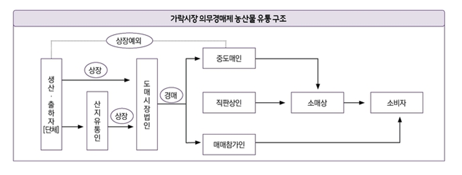

### **도매 시장 문제로 인한 물가 변동 및 온라인 도매시장 도입 후 구조 변화**

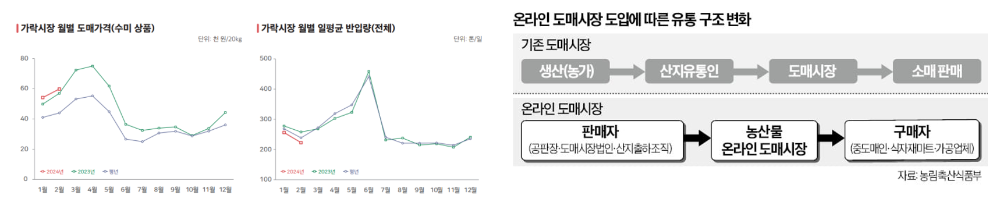

### **품앗이의 목표**

- 농산물 유통 과정을 간소화하여 농민과 소비자를 직접 연결
- 농민이 직접 농산물을 판매할 수 있는 플랫폼 제공
- 소비자가 농산물을 구매할 때 농민에게 공정한 가격을 지불  
&nbsp;  
### **배포 URL**

(비용 문제로 배포 중단)

| **서비스** | **URL**                                              |
|---------|------------------------------------------------------|
| 백엔드     | [https://api.poomasi2.shop](https://api.poomasi2.shop) |
| 프론트엔드 | [https://api.poomasi](https://api.poomasi) |


더 자세한 이야기는 [품앗이 소개 페이지](https://poomasi.shop/introduction)에서 확인하세요.

<br>

## ⭐ **주요 기능**

### **농산물 거래**
- 농부: 등록, 삭제 등
- 구매자: 구매, 장바구니, 위시리스트, 리뷰 작성, 환불 등
  
### **농장 체험**
- 농부: 등록, 삭제 등
- 체험자: 예약, 리뷰 작성, 환불 등

### **store 관리**
- 등록, 상품 조회, 매출 조회 등

### **결제**
- 아임포트(Iamport) 이용한 결제 기능 구현

### **사업자 등록**
- Naver OCR 이용한 사업자 등록증 인식 기능 구현

### **인증/인가**
- Spring Security 및 JWT 활용한 인증/인가 구현
- OAuth 2.0 프로토콜 활용한 카카오 로그인 기능 구현

### **이미지 관리**
- S3 Presigned Url 이용한 이미지 업로드 기능

### **지속적인 통합 및 배포**
- GitHub Actions 활용한 CI/CD 파이프라인 구축
- AWS ECS 및 ALB 활용한 무중단 배포 구현
  
<br>

## 👤 내 역할

### ✅ Backend

- **JWT 기반 인증 시스템 구축**
  - 기존 Refresh Token 방식의 보안 취약점 해결을 위해 **RTR (Refresh Token Rotation)** 기법과 **화이트/블랙리스트 기반 토큰 검증 시스템**을 도입
    → Refresh Token 탈취 시, 신속한 감지 및 차단
  - 서버 부하를 줄이기 위해 **화이트/블랙리스트 저장소를 MySQL → Redis로 전환**    
    → 토큰 조회 성능 개선  
    → **인증 처리 시간 146ms → 45ms로 약 69% 감소**
  
- **CI/CD 파이프라인 구축**
  - 수동 배포의 반복 작업과 오류 발생 가능성을 줄이기 위해 **Docker, GitHub Actions**를 활용해 빌드, 테스트, 배포 자동화 파이프라인을 구축
    → **배포 시간 60% 이상 단축**, 사전 오류 검출을 통한 코드 품질 향상
  - **AWS ECS + ALB 기반 무중단 배포 환경 구축**
    → 재배포시 요청 손실 0건, 트래픽 분산으로 인한 서비스 가용성 향상

- **이미지 업로드 기능 개발**
  - **S3 Presigned URL** 방식 도입
    → 기존 서버 중계 방식 대비 **10개 이미지 동시 업로드 속도 54% 개선**, 서버 부하 감소

- **테스트 및 품질 관리**
  - 회원, 이미지, 인증 도메인에 대해 **JUnit 기반 단위 테스트 40개 작성**, 회원 도메인 **테스트 커버리지 73% 확보**

- **기타 개발**
  - store 및 카테고리별 매출 통계 API 개발, 대용량 데이터 대응을 위한 페이지네이션 적용
  - 탈퇴 계정 복구 기능을 구현하기 위해 Soft Delete 설계 적용

- **협업 기여**
  - Git Flow 전략을 도입하여 협업 효율성 및 코드 품질 향상 
  - 초기에 중복 개발 문제가 발생, 이후 매주 2회 회의 진행 제안하여 팀 내 소통 강화
  - 시장 분석, 요구사항 정의 등 프로젝트 기획 단계 참여 

### 💥 Trouble Shooting

#### 🚨 문제 상황

JWT 화이트리스트와 블랙리스트를 관리하는 시스템을 구축하면서, 배포 환경과 로컬 환경에서 서로 다른 요구사항이 발생했습니다.
- 배포 환경: 고성능 처리가 요구되어 **Redis** 사용이 적합
- 로컬 환경: 별도의 **Redis** 서버 설정 없이 간편한 개발 및 테스트 환경 필요

이로 인해, 저장소 방식 차이에 따른 코드 중복과 유지보수의 어려움이 발생했습니다.

#### ⭐ 해결 방법

- **인터페이스 기반 설계 + 환경별 DI 구성**
  - 배포 환경: Redis 사용
  - 로컬 환경: MySQL 사용, 만료된 토큰 삭제를 위한 스케줄러 구현
  - 환경별 설정 파일 분리(application.yml / application-prod.yml)
  - 인터페이스 기반 설계를 통해 DI 방식으로 구현체 주입

#### ✅ 효과

- 저장소 교체가 용이한 유연한 구조 확보
- 유지보수 시간 **50% 이상 절감**

<br>

## 🛠️ 기술 스택

<div align="center">

### Backend


### Build & Database


### Test


### Cloud & Deployment


### AI & OCR


</div>

<details>
<summary>버전 정보</summary>

- **Gradle JVM**: 22.0.2
- **Spring Boot**: 3.3.1
- **Java**: 21
- **MySQL**: 8.0

</details>

## 📂프로젝트 구조

```
.
├── build
│   ├── classes
│   ├── generated
│   ├── reports
│   └── resources
├── gradle
│   └── wrapper
└── src
    ├── main
    │   ├── java
    │   │   └── poomasi
    │   │       ├── Application.java
    │   │       ├── domain
    │   │       │   ├── auth
    │   │       │   │   ├── security
    │   │       │   │   │   ├── filter
    │   │       │   │   │   ├── handler
    │   │       │   │   │   └── oauth2
    │   │       │   │   ├── signup
    │   │       │   │   └── token
    │   │       │   ├── farm
    │   │       │   │   ├── _category
    │   │       │   │   └── _schedule
    │   │       │   ├── member
    │   │       │   │   ├── _biz
    │   │       │   │   └── _profile
    │   │       │   ├── order
    │   │       │   │   └── _aftersales
    │   │       │   ├── product
    │   │       │   │   ├── _cart
    │   │       │   │   ├── _category
    │   │       │   │   └── _intro
    │   │       │   ├── reservation
    │   │       │   ├── review
    │   │       │   │   ├── farm
    │   │       │   │   └── product
    │   │       │   └── wishlist
    │   │       ├── global
    │   │       │   ├── common
    │   │       │   ├── health
    │   │       │   ├── ocr
    │   │       │   └── util
    │   │       └── payment
    │   └── resources
    └── test
        ├── java
        │   └── poomasi
        │       ├── domain
        │       └── global
        └── resources
```

## 📄 API 명세서

[배포용 품앗이 명세서](https://bubble-pick-143.notion.site/1e48cc52884d4df993857a1e8f58ff26?pvs=4)  
&nbsp;  
## 🗼 BE 아키텍처

  
&nbsp;  
## 🖥️ 주요 화면 미리보기

### 메인 페이지


### 상점 페이지


### 농장체험 페이지


## 📊 ERD 요약

| 항목    | 설명               | ERD 이미지                         |
|-------|------------------|---------------------------------|
| 회원    | 회원의 기본 정보와 관계    | 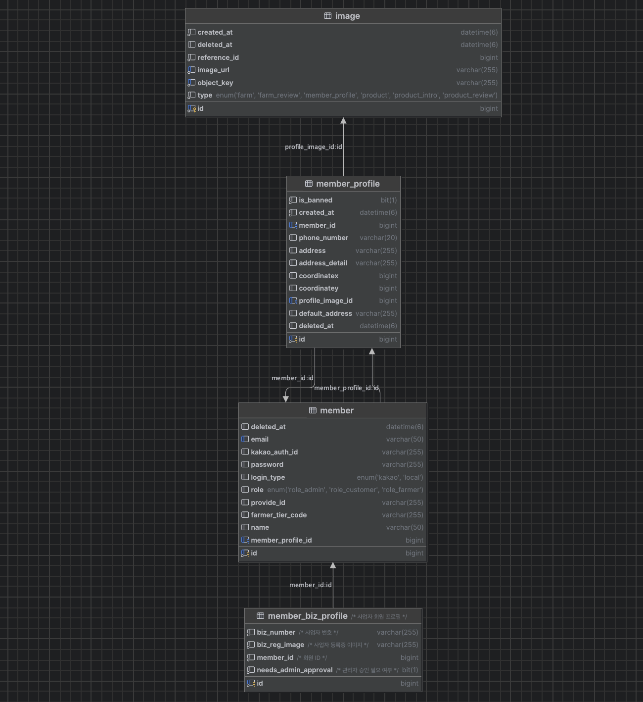  |
| 상품    | 상품 관련 정보와 카테고리   | 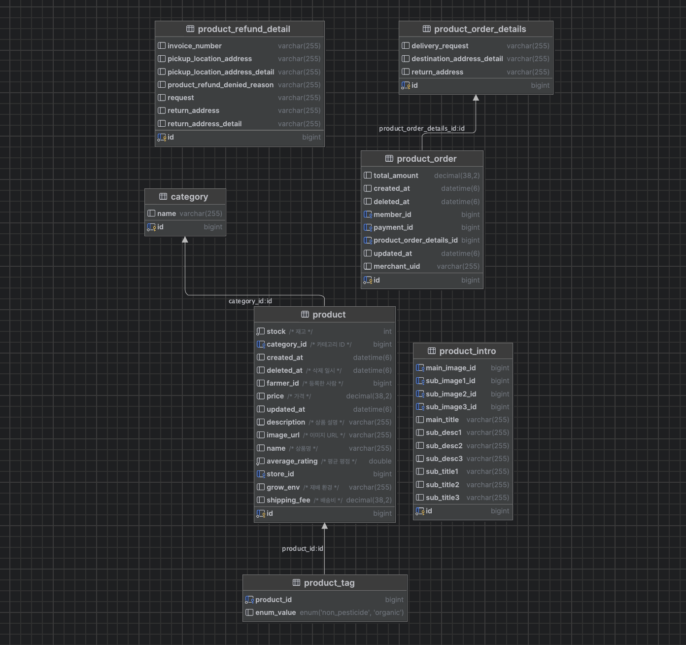 |
| 장바구니  | 상품과 사용자의 연관 관계   | 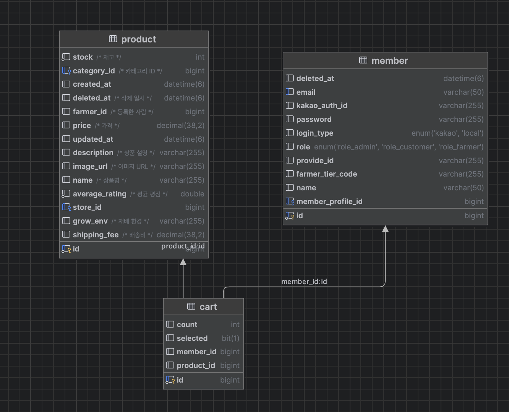      |
| 농장    | 농장 정보와 예약 시스템    | 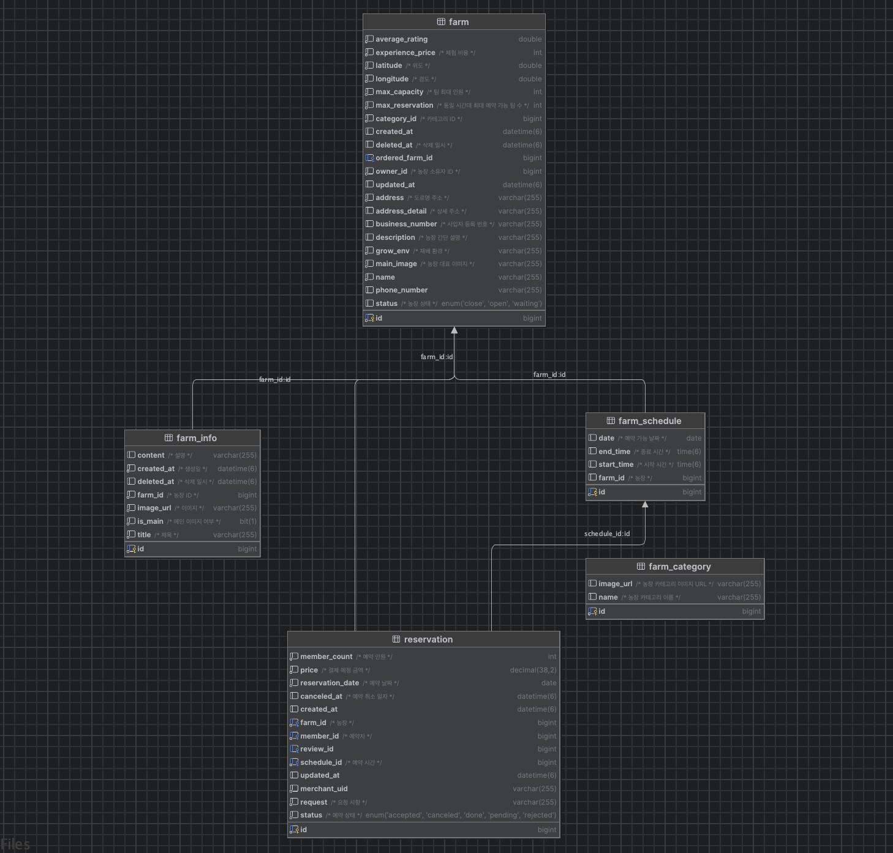    |
| 위시리스트 | 사용자의 관심 상품 저장 정보 | 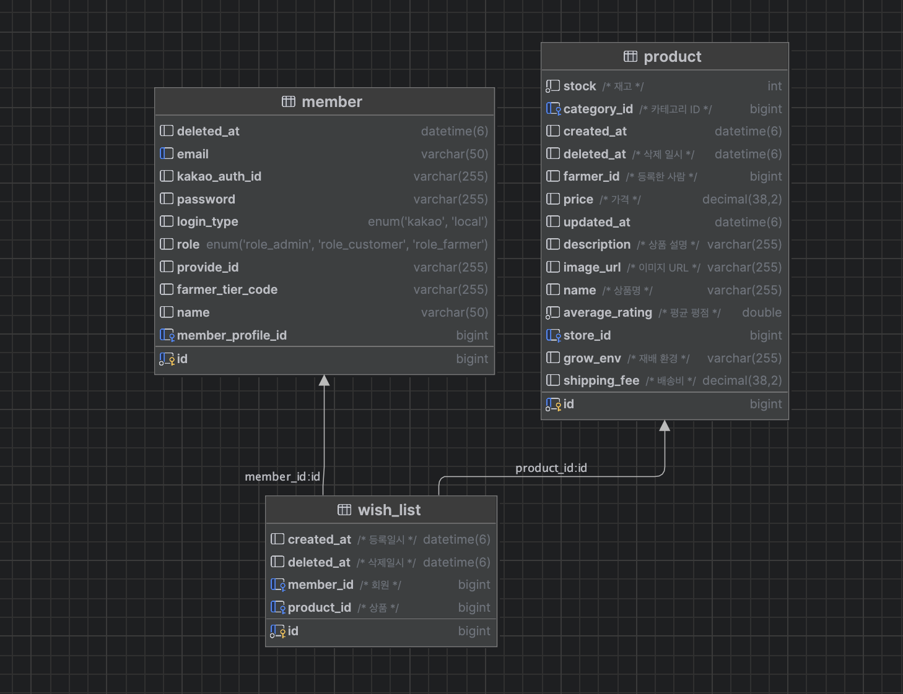 |   
    
&nbsp;   
## 🚀 프로젝트 실행 방법

1. 프로젝트를 클론하고 디렉토리로 이동합니다.

```bash
git clone
cd Team10_BE
```

2. `application-secret.yml` 파일을 프로젝트 루트에 생성하고, 다음과 같은 내용을 추가합니다.

```yaml
spring:
  application:
    name: poomasi
  jpa:
    open-in-view: false
    hibernate:
      ddl-auto: update
    show-sql: true
    properties:
      hibernate:
        format_sql: true
        enable_lazy_load_no_trans: true
        hbm2ddl:
          jdbc_metadata_extraction_strategy: individually
  datasource:
    url: jdbc:mysql://localhost:3306/poomasi
    username: root
    password: <DB_PASSWORD>
    driver-class-name: com.mysql.cj.jdbc.Driver

  data:
    redis:
      port: 6379
      host: <REDIS_HOST>

  security:
    redirect_url: http://localhost:3000
    oauth2:
      client:
        registration:
          kakao:
            client-id: <KAKAO_CLIENT_ID>
            client-secret: <KAKAO_CLIENT_SECRET>
            scope: account_email, profile_nickname
            client-name: Kakao
            authorization-grant-type: authorization_code
            client-authentication-method: client_secret_post
            redirect-uri: http://localhost:8080/login/oauth2/code/kakao
        provider:
          kakao:
            authorization-uri: https://kauth.kakao.com/oauth/authorize
            token-uri: https://kauth.kakao.com/oauth/token
            user-info-uri: https://kapi.kakao.com/v2/user/me
            user-name-attribute: kakao_account

logging:
  level:
    org:
      springframework:
        web: DEBUG

jwt:
  secret: <JWT_SECRET>
  access-token-expiration-time: 3600000  # 1시간
  refresh-token-expiration-time: 604800000  # 7일

aws:
  s3:
    bucket: poomasi
    region: ap-northeast-2
  access: <AWS_ACCESS_KEY>
  secret: <AWS_SECRET_KEY>

imp:
  api:
    key: <IMP_API_KEY>
    secretKey: <IMP_SECRET_KEY>

naver:
  ocr:
    secret: <NAVER_OCR_SECRET>
    invoke: <NAVER_OCR_INVOKE_URL>
    template: <NAVER_OCR_TEMPLATE_ID>
```

3. application-secret.yml 파일을 저장한 후, 프로젝트를 실행합니다.

```
./gradlew bootRun
```

## 🌾 Feature

> 개발한 API들의 핵심 특성을 서술합니다.
&nbsp;  
### 상품 도메인

> 상품 도메인은 상품 정보를 관리하는 도메인입니다.

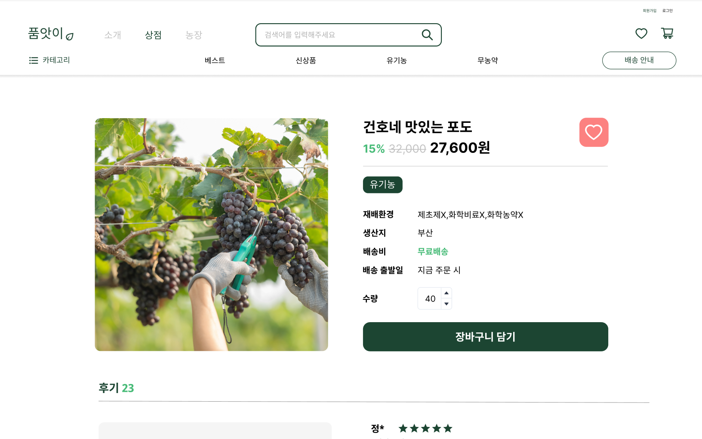  
&nbsp;  
### 농장 도메인

> 농장 도메인은 농장 정보를 관리하는 도메인입니다.

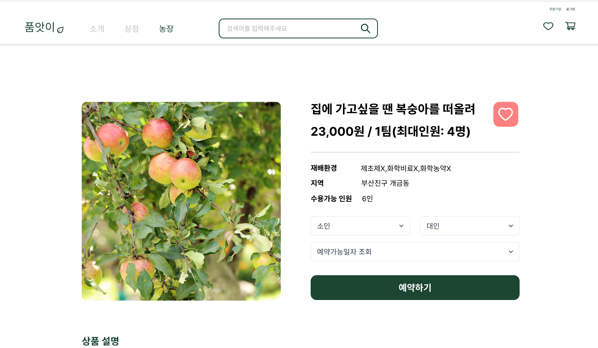  
&nbsp;  
#### 1. 농장 사업자 등록

> 농장 사업자 등록은 농장을 등록하는 기능입니다.

- Naver Template OCR을 사용하여 사업자 등록증을 인식하고, 농장 정보를 등록합니다.
- 원래는 Document OCR이 사업자 등록증 인증을 지원하지만, 비용문제로 Template OCR로 대체하였습니다.
- 또한, 동작 오류를 방지하고자 사업자등록증 인증 실패 시 관리자가 직접 확인하도록 구현하였습니다.

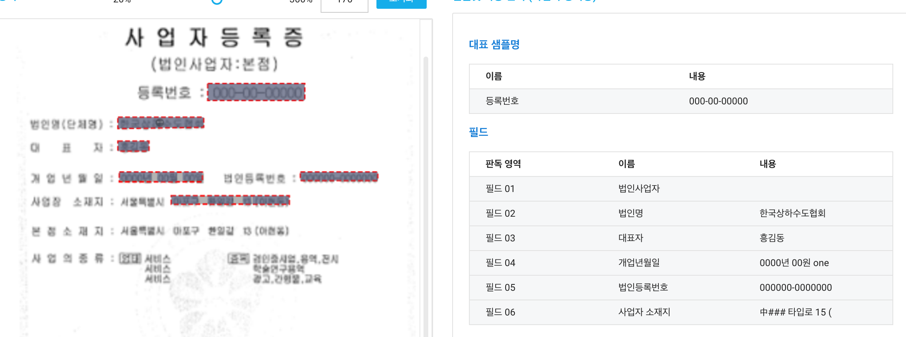  
&nbsp;  
#### 2. 농장 체험 예약

> 농장 체험 예약은 농장에서 진행하는 체험 프로그램을 예약하는 기능입니다.

동 시간대 수용가능한 팀 및 최대 수용가능한 팀원을 확인하여 예약을 진행합니다.    
&nbsp;  
## 🔒 Security 설정

> Spring Security 6.3.1 버전을 사용하여 인증 및 인가를 진행하였습니다.  
> 기본적으로 Spring Security는 Filter를 기반으로 인증 및 인가를 진행합니다.  
> 필터는 OAuth2.0 필터 -> JWT 인증 필터 -> 로그아웃 -> 일반 로그인 필터 순으로 구현하였습니다.

<details>
<summary>기본 로그인</summary>

- 서버 DB에 저장된 사용자의 정보를 기반으로 진행하는 로그인입니다.
- `UsernamePasswordAuthenticationFilter`를 커스터마이징하여 로그인을 진행합니다.

</details>

<details>
<summary>카카오 로그인</summary>

- OAuth 2.0 프로토콜을 사용하여 카카오 계정을 통한 로그인을 제공합니다.
- Spring Security Oauth2.0 로그인을 활성화하여 진행합니다.
- 이는 `Spring Security`에서 제공하는 `Oauth2.0 로그인`을 활성화시켜 구현하였습니다.

</details>

<details>
<summary>JWT token</summary>

- `로그인에 성공`하면 JWT(Json Web ToKen)을 발행합니다.
- Http Header에 Bearer `<accessToken>` 형태로 access token을 전달합니다.
- JWT를 발행하기 위해 `jjwt 0.11.5`을 사용하였습니다.
- `OAuth2.0` 로그인이 성공하면 자체 서버로 `redirect`를 시킵니다.
- 이후 `access token`은 query parameter를 통해 브라우저에게 전달합니다.
- `refresh token`은 HttpOnly Cookie를 통해 xss 공격을 방지합니다.

</details>

<details>
<summary>OAuth2AuthorizationRequestRedirectFilter, OAuth2LoginAuthenticationFilter</summary>

- OAuth2.0 로그인을 활성화하면 사용하는 필터입니다.
- `OAuth2AuthorizationRequestRedirectFilter` 필터는 OAuth2.0 인증 서버로 redirect하는 필터입니다.
- `OAuth2LoginAuthenticationFilter` 필터는 OAuth2.0 인증을 실질적으로 수행하는 필터입니다.
- 카카오톡 동의항목을 통해 유저의 닉네임과 이메일을 제공받았습니다.

</details>

<details>
<summary>JwtAuthenticationFilter</summary>

- `JWT`를 검증하는 필터입니다.
- 시간이 만료되면 재발급하라는 메시지를 담아서 보냅니다.
- 인증되지 않은, 즉 변조된 토큰이라면 이는 잘못된 접근이라 판단해 401 UnAuthorization 에러를 브라우저에게 전달합니다.

</details>

<details>
<summary>JwtLogoutFilter</summary>

- `로그아웃`을 진행하는 필터입니다.
- 토큰을 통한 인증/인가는 웹 통신의 특성상 sniffing 및 spoofing 공격을 대응하기 어렵습니다.
- 이러한 점을 방지해 로그아웃 요청이 온다면 인메모리 캐시(redis) 혹은 데이터베이스(DB)에 로그아웃 요청이 온 accesstoken을 저장합니다.

</details>

<details>
<summary>CustomUsernamePasswordAuthenticationFilter</summary>

- `Spring Security`의 `UsernamePasswodAuthenticationFilter`를 커스터마이징한 필터입니다.
- 로그인에 성공하면 `JWT`를 브라우저에게 돌려줍니다.

</details>

<br>

### ️✔️ 화이트리스트 방식 구현

> 토큰 재발급 시 사용자 검증을 하기 위해 토큰 발급 때마다 `RefreshToken`을 화이트리스트에 저장합니다.


#### 토큰 재발급 흐름

	1. 로그인 시 서버는 `RefreshToken`을 Redis 화이트리스트에 추가합니다.
	2. 토큰 재발급 요청 시 클라이언트는 `AccessToken1`과 `RefreshToken1`을 서버에 보냅니다.
	3. 서버는 AccessToken1 검증 후 Redis 화이트리스트에서 `RefreshToken1`이 존재하는지 확인합니다.
	4. `RefreshToken1`이 존재하면, 서버는 `AccessToken2`와 `RefreshToken2`를 새로 생성하여 클라이언트에 반환합니다.
	5. `RefreshToken1`이 존재하지 않는다면, 서버는 사용자를 로그아웃 처리합니다.

화이트리스트 방식을 사용함으로써 사용자가 토큰을 탈취당했을 때, 공격자가 요청을 보내도 이를 허용하지 않습니다.

<br>

### ✔️ 블랙리스트 방식 구현

> 로그아웃한 사용자의 `AccessToken`을 사용하여 요청을 보내는 것을 방지하기 위해 로그아웃 시 `AccessToken`을 블랙리스트에 저장합니다.
 


#### 로그아웃 흐름

	1. 클라이언트가 로그아웃 요청을 합니다.
	2. 서버는 요청에서 `AccessToken`을 추출합니다.
	3. 서버는 해당 `AccessToken`을 Redis 블랙리스트에 추가합니다.
	4. 클라이언트가 AccessToken과 함께 요청을 보낼 때마다 서버는 Redis 블랙리스트를 확인하여 `AccessToken`의 유효성을 검증합니다.
	5. `AccessToken`이 블랙리스트에 포함되어 있으면, 서버는 요청을 무효화하고, 클라이언트에 인증 실패 응답을 반환합니다.

블랙리스트 방식을 사용함으로써 로그아웃한 사용자가 요청을 보낼 때, 또는 공격자가 해당 사용자의 토큰으로 요청을 보낼 때, 요청을 허용하지 않습니다.

<br>

## 💳 결제 시스템

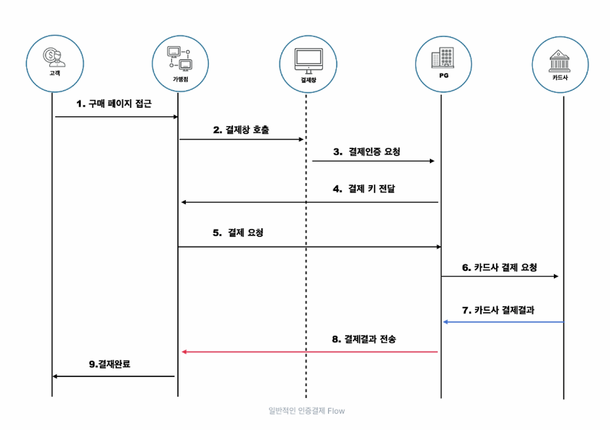

**결제 과정**

	1. 백엔드에서 결제 예정 금액을 계산해 PG 사에 결제 요청을 합니다. (재고확인 1회)
	2. 구매 페이지에서 결제 버튼을 누르면 백엔드에서 결제 요청을 합니다.
	3. 백엔드에서 결제 요청을 받아 결제 요청을 PG 사에 전달합니다.
	4. PG 사에서 결제 요청을 받아 카드사에 결제 요청을 합니다.
	5. 카드사에서 결제 결과를 PG 사에 전달합니다.
	6. PG 사에서 결제 결과를 받아 백엔드에 결제 결과를 전달합니다.
    7. 백엔드에서 결제 결과를 받아 결제 결과를 사용자에게 전달합니다. (재고확인 2회 & PG사에 요쳥해 결제 완료 확인 및 결제 완료 표시)

**환불 정책**

    - 농장 체험일 3일 전에는 환불 수수료 50%를 부과합니다.
    - 상품 구매 후 환불 할 때 배송비 3,000원을 부과합니다.   
   
## 🌃 이미지 관리 (S3: Presigned URL)

> `presigned url`을 사용하여 이미지를 관리합니다.


`presigned url`: 다른 사람(클라이언트)로 하여금 버킷에 객체를 업로드/조회할 수 있다. 해당 url을 사용할 경우 AWS 보안 자격 증명이나 권한이 없어도 접근 할 수 있다.


**이미지 업로드**

    1. Client 에서 presigned url을 백엔드 서버로 요청합니다.
    2. 백엔드 서버에서 S3에 이미지를 업로드할 수 있는 presigned url을 생성합니다.
    3. Client에서 생성된 presigned url을 사용하여 이미지를 업로드합니다.
    4. S3에 이미지가 업로드되면 백엔드 서버에 이미지 경로 값을 전달합니다.

- 백엔드 서버에서 이미지를 직접 업로드하면 서버의 부하가 증가합니다.
- presigned url을 사용하면 클라이언트에서 직접 이미지를 업로드할 수 있습니다.
- 따라서, 이미지 업로드 처리 속도가 빨라집니다.

<br>

## 🔄 지속적인 통합 및 배포

**배포 개요**

본 프로젝트는 GitHub Actions를 활용하여 ECS 및 EC2 환경에 자동으로 배포됩니다. Bridge 네트워크 모드로 Docker 컨테이너를 구성하여, ELB를 통해 외부 요청을 안정적으로 분산 처리할 수
있도록 설정되어 있습니다.

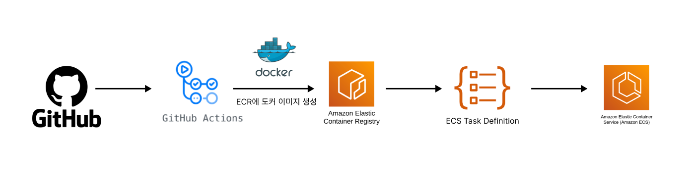

**배포 프로세스**

	1.	코드 변경 및 트리거: prod 브랜치에 코드가 푸시될 때마다 GitHub Actions가 자동으로 배포 프로세스를 시작합니다.
	2.	빌드 및 테스트: Gradle을 통해 프로젝트를 빌드하고, Docker 이미지를 생성합니다.
	3.	Amazon ECR에 이미지 저장: 생성된 Docker 이미지를 Amazon ECR에 푸시하여 이미지의 버전 관리를 수행합니다.
	4.	ECS에 배포 및 업데이트: 새로운 Docker 이미지가 ECS Task Definition에 반영되어 ECS에서 새로운 컨테이너를 자동으로 시작합니다.
	5.	ELB를 통한 로드 밸런싱: ELB(Elastic Load Balancer)를 사용하여 외부 요청을 분산 처리하고, 높은 트래픽을 안정적으로 관리할 수 있도록 설정합니다.

**알림 및 모니터링**

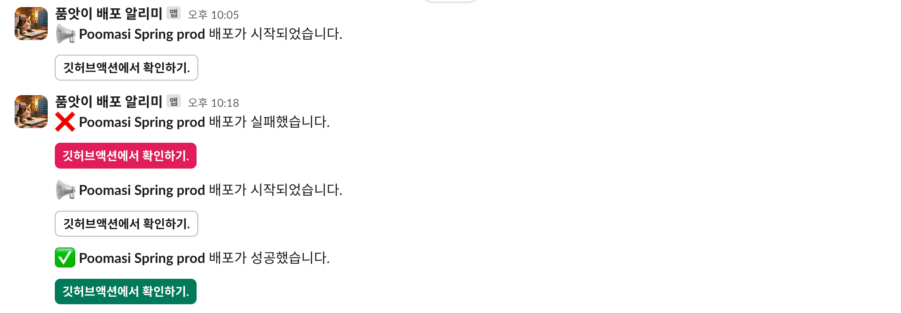

	Slack 알림: 빌드 및 배포 상태는 Slack 채널로 알림이 전송되며, 성공 및 실패 여부에 따라 적절한 알림 메시지가 전송됩니다. 이를 통해 실시간으로 배포 상태를 파악할 수 있습니다.

## 👥 Collaborators

<h3 align="center"> Backend</h3>
<div align="center">
<table align="center">
  <tr>
    <td align="center" width="200px">
      <a href="https://github.com/amm0124" target="_blank">
        
      </a>
    </td>
    <td align="center" width="200px">
      <a href="https://github.com/canyos" target="_blank">
        
      </a>
    </td>
    <td align="center" width="200px">
      <a href="https://github.com/stopmin" target="_blank">
        
      </a>
    </td>
    <td align="center" width="200px">
      <a href="https://github.com/jjt4515" target="_blank">
        
      </a>
    </td>
  </tr>
  <tr>
    <td align="center">
      <a href="https://github.com/amm0124" target="_blank">김건호</a>
    </td>
    <td align="center">
      <a href="https://github.com/canyos" target="_blank">이풍헌</a>
    </td>
    <td align="center">
      <a href="https://github.com/stopmin" target="_blank">정지민</a>
    </td>
    <td align="center">
      <a href="https://github.com/jjt4515" target="_blank">정진택</a>
    </td>
  </tr>
</table>
</div>
<h3 align="center"> FrontEnd</h3>

<div align="center">
<table align="center">
  <tr>
    <td align="center" width="200px">
      <a href="https://github.com/jasper200207" target="_blank">
        
      </a>
    </td>
    <td align="center" width="200px">
      <a href="https://github.com/rudtj" target="_blank">
        
      </a>
    </td>
  </tr>
  <tr>
    <td align="center">
      <a href="https://github.com/jasper200207" target="_blank">김도균</a> 
    </td>
    <td align="center">
      <a href="https://github.com/rudtj" target="_blank">이경서</a>
    </td>
  </tr>
</table>
</div>
